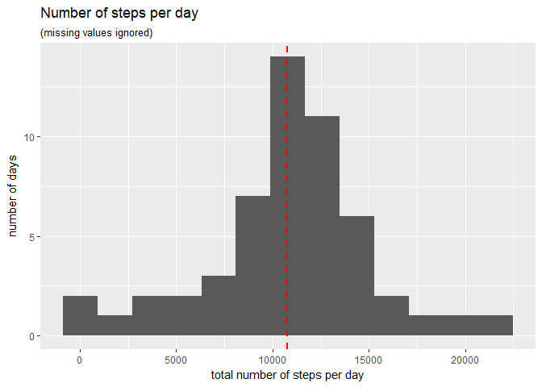
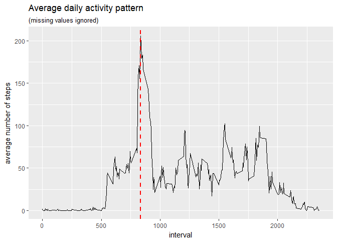
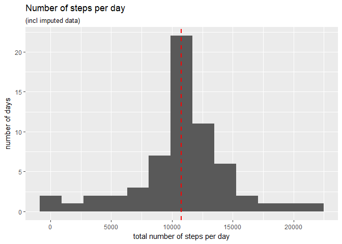
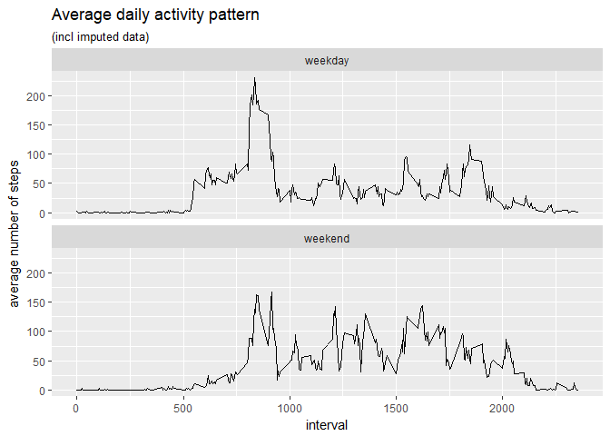

## Loading and preprocessing the data


```r
library(readr)
library(dplyr)
library(ggplot2)
# Load activity data
activity <- read_csv("activity.zip")
```


## What is mean total number of steps taken per day?


```r
# Calculations for total steps per day
activity_per_day <- activity %>%
  filter(!is.na(steps)) %>%
  group_by(date) %>%
  summarise(steps_per_day = sum(steps, na.rm = TRUE)) %>%
  ungroup()

mean_steps_day <- as.character(round(mean(activity_per_day$steps_per_day, na.rm = TRUE)))
median_steps_day <- as.character(round(median(activity_per_day$steps_per_day, na.rm = TRUE)))
```


```r
# Create a histogram on steps per day 
# I adjusted the 'binwidth' to 1800
activity_per_day %>%
  ggplot(aes(x = steps_per_day)) +
  geom_histogram(binwidth = 1800) +
  geom_vline(aes(xintercept = mean(steps_per_day, na.rm = TRUE)), col='red', size=1, lty=2) + 
  ylab("number of days") +
  xlab("total number of steps per day") +
  ggtitle("Number of steps per day", subtitle = "(missing values ignored)")
```

<!-- -->

The mean total number of steps taken per day is 10766.
The median total number of steps taken per day is 10765.


## What is the average daily activity pattern?


```r
# Calculations for average steps per interval
daily_activity_pattern <- activity %>%
  filter(!is.na(steps)) %>%
  group_by(interval) %>%
  summarise(avg_steps = mean(steps, na.rm = TRUE)) %>%
  ungroup()

max_interval <- daily_activity_pattern %>%
  filter(avg_steps == max(avg_steps, na.rm = TRUE))
```


```r
# Create time series plot on average steps per interval
daily_activity_pattern %>%
  ggplot(aes(x = interval, y = avg_steps)) +
  geom_line()+
  geom_vline(aes(xintercept = max_interval$interval), col='red', size=1, lty=2) + 
  ggtitle("Average daily activity pattern", subtitle = "(missing values ignored)") +
  ylab("average number of steps")
```

<!-- -->

On average across all the days in the dataset, interval 835 contains the maximum number of steps.


## Imputing missing values
The activiy dataset contains 2304 rows with NA's.


```r
summary(activity)
```

```
##      steps             date               interval     
##  Min.   :  0.00   Min.   :2012-10-01   Min.   :   0.0  
##  1st Qu.:  0.00   1st Qu.:2012-10-16   1st Qu.: 588.8  
##  Median :  0.00   Median :2012-10-31   Median :1177.5  
##  Mean   : 37.38   Mean   :2012-10-31   Mean   :1177.5  
##  3rd Qu.: 12.00   3rd Qu.:2012-11-15   3rd Qu.:1766.2  
##  Max.   :806.00   Max.   :2012-11-30   Max.   :2355.0  
##  NA's   :2304
```

The missing values are imputed whit mean for the specific 5-minute interval:


```r
# impute missing data
activity_imputed <- activity %>%
  group_by(interval) %>%
  mutate(steps = ifelse(!is.na(steps), steps, mean(steps, na.rm = TRUE))) %>%
  ungroup()

summary(activity_imputed)
```

```
##      steps             date               interval     
##  Min.   :  0.00   Min.   :2012-10-01   Min.   :   0.0  
##  1st Qu.:  0.00   1st Qu.:2012-10-16   1st Qu.: 588.8  
##  Median :  0.00   Median :2012-10-31   Median :1177.5  
##  Mean   : 37.38   Mean   :2012-10-31   Mean   :1177.5  
##  3rd Qu.: 27.00   3rd Qu.:2012-11-15   3rd Qu.:1766.2  
##  Max.   :806.00   Max.   :2012-11-30   Max.   :2355.0
```


```r
# Calculate total steps per day incl imputated data
activity_per_day_imputed <- activity_imputed %>%
  group_by(date) %>%
  summarise(steps_per_day = sum(steps, na.rm = TRUE)) %>%
  ungroup()

mean_steps_day_imputed <- as.character(round(mean(activity_per_day_imputed$steps_per_day, na.rm = TRUE)))
median_steps_day_imputed <- as.character(round(median(activity_per_day_imputed$steps_per_day, na.rm = TRUE)))
```


```r
# Create a histogram on total steps per day incl imputed data 
# I adjusted the 'binwidth' to 1800
activity_per_day_imputed %>%
  ggplot(aes(x = steps_per_day)) +
  geom_histogram(binwidth = 1800) +
  geom_vline(aes(xintercept = mean(steps_per_day, na.rm = TRUE)), col='red', size=1, lty=2) + 
  ylab("number of days") +
  xlab("total number of steps per day") +
  ggtitle("Number of steps per day", subtitle = "(incl imputed data)")
```

<!-- -->

After imputing missing values. The mean total number of steps taken per day is 10766.
And the median total number of steps taken per day is 10766. These are not much different then before. 
The impact of imputing missing data on the estimates of the total daily number of steps is that there are lot's more days with an average number of steps than before.


## Are there differences in activity patterns between weekdays and weekends?


```r
# Add factor value to imputated data wich indicates weekdays and weekends
activity_imputed <- activity_imputed %>%
  mutate(weekday = weekdays(date)) %>%
  mutate(weekday = ifelse(weekday == "zaterdag" | weekday == "zondag", "weekend", "weekday")) %>%
  mutate(weekday = as.factor(weekday))
```


```r
# Calculations for average steps per interval per weekday/weekend
daily_activity_pattern_imputed <- activity_imputed %>%
  group_by(interval, weekday) %>%
  summarise(avg_steps = mean(steps, na.rm = TRUE)) %>%
  ungroup()
```


```r
# Create time series graph on avg steps per interval for imputed data per weekday
daily_activity_pattern_imputed %>%
  ggplot(aes(x = interval, y = avg_steps))+
  geom_line()+
  facet_wrap(~weekday, nrow = 2, ncol = 1)+
  ggtitle("Average daily activity pattern", subtitle = "(incl imputed data)") +
  ylab("average number of steps")
```

<!-- -->


